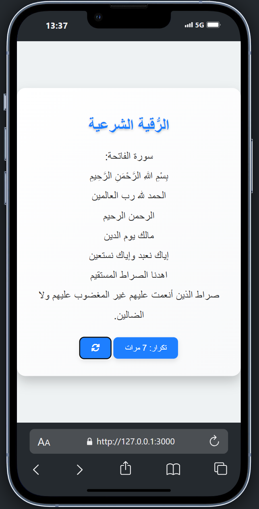

# 📱 Roqya Omar Akami App

  
  
  
  
  


---

### 🌟 **Description**

**Roqya Omar Akami App** est une application Android interactive construite avec **Cordova**, dédiée à la mémoire de mon frère défunt. Que cette initiative serve de **sadaqa jariya (aumône continue)**, priant qu'Allah lui accorde Sa miséricorde et Sa lumière dans l'au-delà.

Cette application propose une interface simple et intuitive pour accompagner les utilisateurs dans les pratiques de la **Roqya** (méthodes spirituelles islamiques de guérison par le Coran et les invocations).
---

## 🌟 **Démonstration du site**

Cliquez sur l'image ci-dessous pour visionner le projet :

<a href="https://akamidev.github.io/roqyaOmarAkami/" target="_blank">
    
</a>

Ou accédez directement via ce lien : 

- [🔗 Voir la Démonstration](https://akamidev.github.io/roqyaOmarAkami/)

---

### 🚀 **Fonctionnalités**

- 🔹 **Interface utilisateur moderne** : Responsive et conviviale.  
- 🔹 **Technologies performantes** : Basée sur HTML, CSS et JavaScript.  
- 🔹 **Facilement personnalisable** : Structure du code claire et bien documentée.  

---

### 📂 **Structure du Projet**

```plaintext
roqyaApp/
├── www/
│   ├── css/           # Fichiers de style CSS
│   ├── img/           # Images et ressources visuelles
│   ├── js/            # Scripts JavaScript
│   └── index.html     # Point d'entrée principal
├── config.xml         # Configuration globale Cordova
├── package.json       # Dépendances et scripts
├── platforms/         # Plateformes générées (Android)
└── resources/         # Icônes et splashscreens
